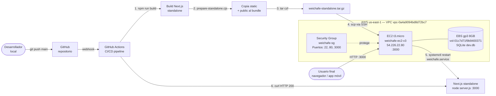
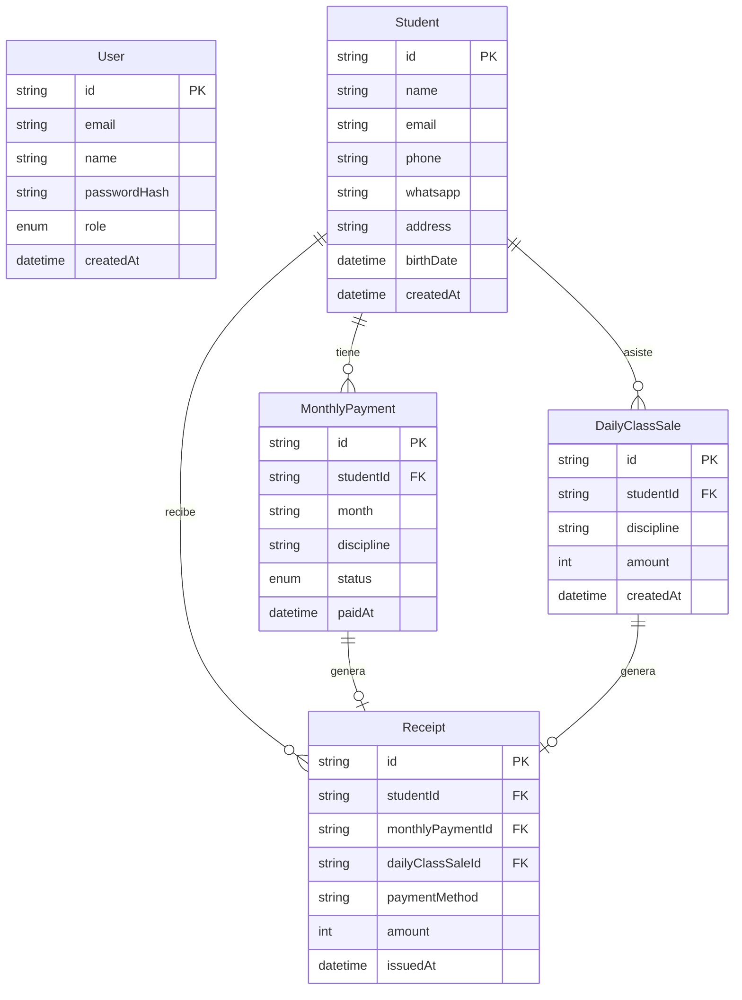

# Arquitectura y Stack Técnico — Weichafe

## Stack técnico

### Frontend
| Tecnología | Versión | Rol |
|---|---|---|
| Next.js | 16.2.4 | Framework principal (App Router + Turbopack) |
| React | 19 | UI components |
| TypeScript | 5 | Tipado estático |
| Tailwind CSS | 4 | Estilos utilitarios |
| Nunito + Oswald | — | Tipografías (Google Fonts) |

### Backend
| Tecnología | Versión | Rol |
|---|---|---|
| Next.js API Routes | 16.2.4 | Endpoints REST (`/api/*`) |
| Next.js Server Actions | 16.2.4 | Mutaciones del servidor |
| Prisma | 6 | ORM y migraciones |
| SQLite | — | Base de datos (archivo `dev.db`) |
| jose | — | JWT HS256 para sesiones |
| bcryptjs | — | Hash de contraseñas |

### Autenticación
- Cookie HTTP-only `weichafe-session`, validez 7 días
- Roles: `ADMIN` y `STAFF`
- Variable `COOKIE_SECURE=true` habilita `Secure` solo si hay HTTPS

### Infraestructura (AWS)
| Recurso | Detalle |
|---|---|
| EC2 | `weichafe-ec2-v3`, t3.micro, us-east-1c, IP pública `54.226.22.80` |
| EBS | `vol-01c7d71f9b9400371`, 8 GB gp3, adjunto a EC2 |
| VPC | `vpc-0a4a9094bd8d72bc7`, CIDR 172.31.0.0/16 (default) |
| Security Group | `weichafe-sg` (sg-099983a0b6d4f565c) — puertos 22, 80, 443, 3000 |
| Key Pair | `weichafe-key` |

### CI/CD
- GitHub Actions (`.github/workflows/deploy.yml`)
- Trigger: push a `main`
- Pasos: `npm run build` → `prepare-standalone.cjs` → `tar` → `scp` → `ssh systemctl restart weichafe.service`
- Verificación final: `curl` HTTP 200 al servidor

### Desktop (Electron)
- `electron/main.cjs` + electron-builder
- Targets: Windows (NSIS installer) y macOS (DMG)
- Ícono: `public/weichafe.jpg`

### Mobile (Capacitor)
- iOS y Android como WebView apuntando a la URL pública del servidor
- Configuración en `capacitor.config.ts`

---

## Diagrama de flujo de la aplicación

```mermaid
flowchart TD
    A([Usuario accede a la app]) --> B{¿Tiene cookie de sesión?}
    B -- No --> C[/login]
    C --> D[Formulario login\nemail + contraseña]
    D --> E[POST /api/auth/login\nbcrypt compare]
    E -- Credenciales inválidas --> D
    E -- OK --> F[Genera JWT HS256\nCookie httpOnly 7 días]
    F --> G[[Dashboard / portada]]
    B -- Sí, JWT válido --> G

    G --> H{Rol de usuario}
    H -- ADMIN --> I[Panel Admin\n/admin]
    H -- STAFF --> J[Panel Operaciones]

    I --> K[Gestión de alumnos]
    I --> L[Mensualidades]
    I --> M[Clases diarias]

    K --> N[POST /api/students\nPrisma: Student.create]
    L --> O[POST /api/monthly-payments\nPrisma: MonthlyPayment.create]
    M --> P[POST /api/daily-class-sales\nPrisma: DailyClassSale.create]

    O --> Q{¿Estado = pagado?}
    Q -- Sí --> R[Server Action\ncrea Receipt automático]
    P --> R

    R --> S[Comprobante en /comprobantes/:id\nBotón imprimir]
    S --> T[window.print]

    G --> U[Logout\nPOST /api/auth/logout]
    U --> V[Limpia cookie]
    V --> C
```

---

## Diagrama de arquitectura AWS



---

## Flujo de datos: modelo de dominio


